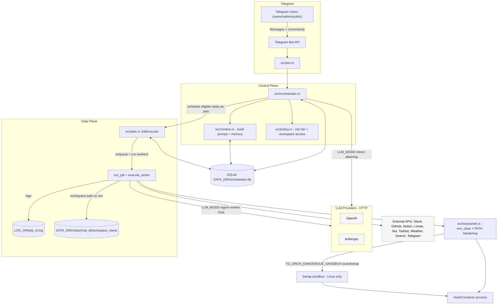

# Architecture

This document describes the core runtime components of SafePilot and how data flows from a
Telegram message to executed jobs.

## Diagram

Notes:
- Jobs are durable: tasks and jobs are stored in SQLite, and [`src/bot.rs`](../src/bot.rs) can
  watch job state and report progress back to Telegram.
- Checkpoints are enforced by the scheduler (run windows like `/trusted` and `/unsafe`), and some
  actions have execution-time enforcement as defense-in-depth (for example Telegram target checks in
  [`src/jobs.rs`](../src/jobs.rs)).
- Sensitive DB fields are encrypted at rest by default.
  - key source precedence: `ORCH_MASTER_KEY` / `ORCH_MASTER_KEY_FILE` / auto-generated local key
  - selected fields only (not full-database encryption)
  - `enc:v1:...` values in `*_FILE` secrets are decrypted on load.

## Key Concepts

- **Chat**: a Telegram chat/channel/group context where messages are received.
- **Access role**: the caller role (`owner`, `admin`, `public`) resolved from access-control state.
- **Channel binding**: maps an integration target (for example `telegram:-100...`) to a workspace
  and mode (`public_skill`) with per-binding policies.
- **Run**: a durable unit of work associated with a chat (stored in SQLite). A run owns:
  - a DAG of **Tasks** (planned work items)
  - a workspace path (typically `DATA_DIR/chats/<chat_id>/<workspace_name>`)
- **Task**: a planned action (e.g. `git`, `search`, `agent`, `shell`). Tasks can depend on other
  tasks. Each task has a **risk tier** (`safe`, `needs_approval`, `dangerous`).
- **Job**: the execution record for a task. A job runs a concrete action type with a goal string,
  writes logs to `LOG_DIR/<job_id>.log`, and stores a result in the DB.

## Control Plane vs Data Plane

- **Control plane**:
  - Telegram handlers ([`src/bot.rs`](../src/bot.rs))
  - Orchestrator + scheduler ([`src/orchestrator.rs`](../src/orchestrator.rs))
  - Policy classification + checkpoints ([`src/policy.rs`](../src/policy.rs))
- **Data plane**:
  - Job runner ([`src/jobs.rs`](../src/jobs.rs))
  - Tool implementations ([`src/tools/`](../src/tools/))

The control plane decides *what may run* and *when*. The data plane performs the execution in a
controlled environment (env-cleared subprocesses, optional sandboxing, allowlists, SSRF checks).

## Message To Execution Flow

1) Telegram message arrives ([`src/bot.rs`](../src/bot.rs))
- Resolves caller role (`owner/admin/public`).
- Applies command ACL by role and routes channel/group traffic through binding-based workspace routing.
- Routes commands (`/approve`, `/unsafe`, `/trusted`, etc) to the orchestrator.

2) Planning ([`src/orchestrator.rs`](../src/orchestrator.rs))
- Converts user message into a run update: tasks + actions (depending on `LLM_MODE`).
- Stores run/task state in SQLite.

3) Policy + checkpoints ([`src/policy.rs`](../src/policy.rs))
- Each task is classified into a risk tier.
- `safe` tasks are auto-scheduled.
- `needs_approval` tasks block until `/approve` or `/trusted`.
- `dangerous` tasks block until `/approve` or `/unsafe`.

4) Job execution ([`src/jobs.rs`](../src/jobs.rs))
- Executes eligible tasks as jobs.
- Writes logs to `LOG_DIR/<job_id>.log`.
- For subprocess actions, clears the environment and sets a minimal `PATH`
  (see `TG_ORCH_SAFE_PATH`).
- For dangerous actions, may use sandboxing (bubblewrap on Linux, if configured).

5) Follow-ups and resumption
- When agent-mode tool calls are checkpointed, the orchestrator creates a task/job for the tool
  action and queues a follow-up agent task to resume after completion.

## Storage Layout

- `DATA_DIR/orchestrator.db`: SQLite DB (runs, tasks, approvals, messages, summaries, jobs, workspaces, bindings, access-control state)
- `DATA_DIR/chats/<chat_id>/<workspace_name>`: workspace directories used by runs
- `LOG_DIR/<job_id>.log`: per-job execution logs

## Trust Boundaries

- Tool outputs, fetched pages, search results, and repository content are treated as untrusted.
- Operator messages are trusted for management actions. Public-channel messages are treated as
  untrusted input constrained by workspace role, skill, binding policy, and runtime gates.
- Enforcement lives in the scheduler (checkpoints) and at execution time (allowlists, SSRF, sandbox).

For the detailed checkpoint rules, see [`docs/security-model.md`](security-model.md). For deployment
hardening, see [`docs/hardening.md`](hardening.md). For Docker deployment, see
[`docs/docker.md`](docker.md).
